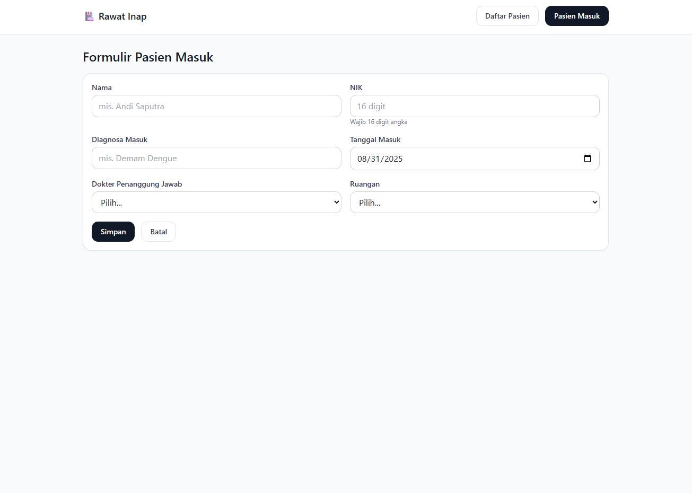
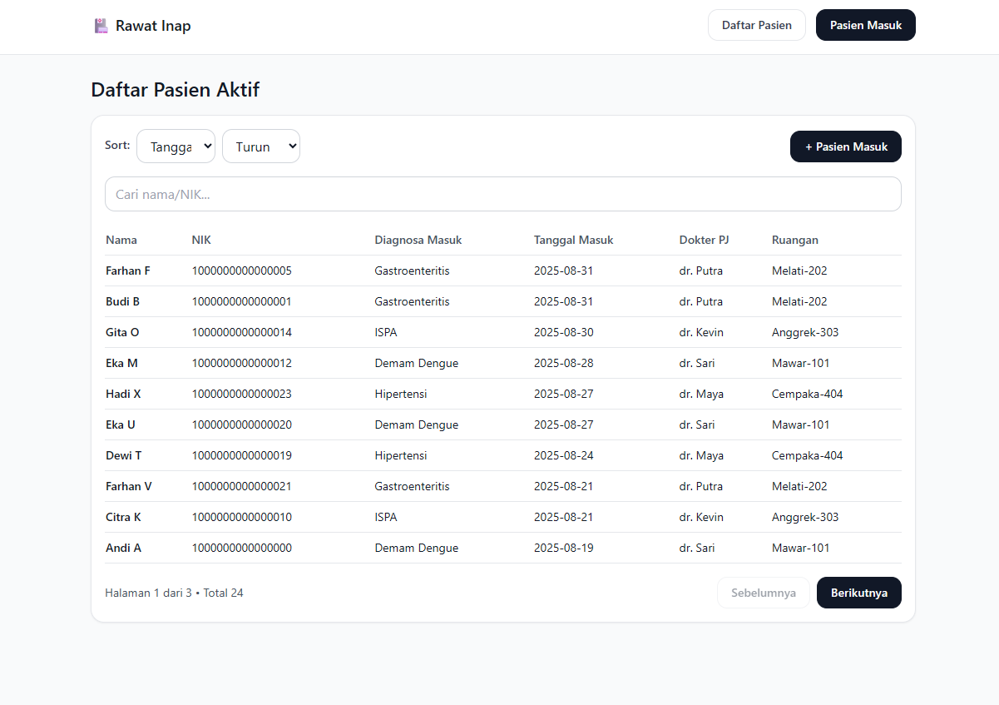

# 🏥 Modul Rawat Inap – Pasien Masuk  

  
  
  
  

> 💡 Mini project simulasi **Modul Rawat Inap**: pasien masuk, daftar pasien, sorting, search, pagination, dan router sederhana.  
> Dibangun dengan **Next.js (App Router) + TypeScript + TailwindCSS + Zustand**.  

---

## Menjalankan Proyek

```bash
pnpm install # atau npm install / yarn
pnpm dev     # atau npm run dev / yarn dev
```

Bisa langsung Buka: http://localhost:3000

## Fitur
- Formulir Pasien Masuk (validasi: required, NIK 16 digit)
- Daftar Pasien Aktif (mock data + delay 500ms)
- Sorting (Nama / Tanggal Masuk)
- Search (Nama / NIK)
- Pagination
- Loading state & Empty state
- Router: `/patients` ↔ `/patients/new`

## Catatan Teknis
- Tipe ketat (no `any`).
- Komponen reusable: InputField, SelectField, Pagination, Spinner.
- State global via Zustand (persist `localStorage`).
- Styling sederhana & rapi dengan Tailwind.

## Preview (Mockup)
-  Pasien Masuk


- Daftar Pasien Aktif


## 🧑‍💻 Stack

-- Next.js (App Router) → routing modern dan file-based
-- TypeScript → tipe ketat, aman dari any liar
-- TailwindCSS → styling cepat & konsisten
-- Zustand → state management ringan, persisten di localStorage